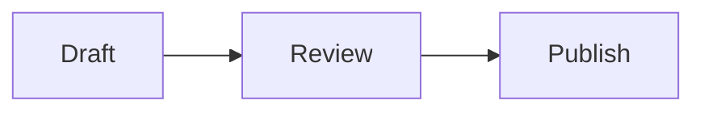
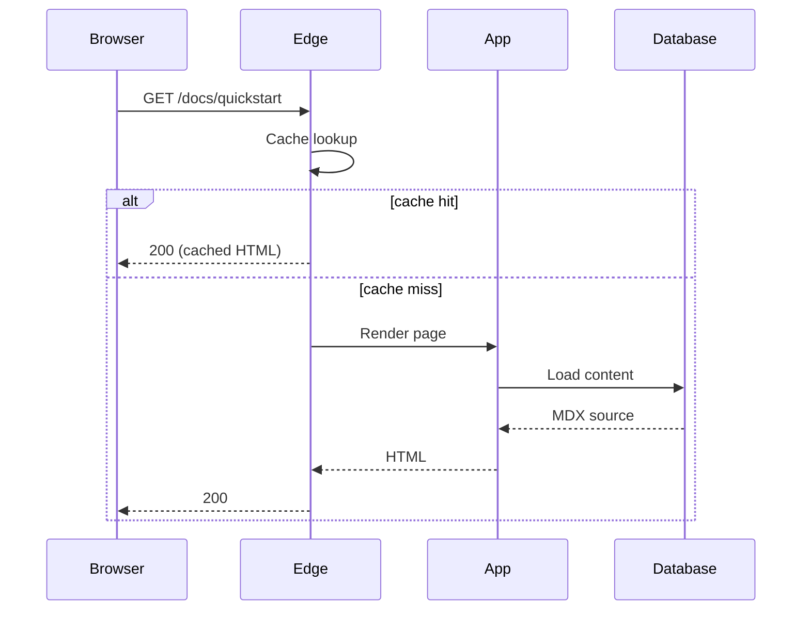
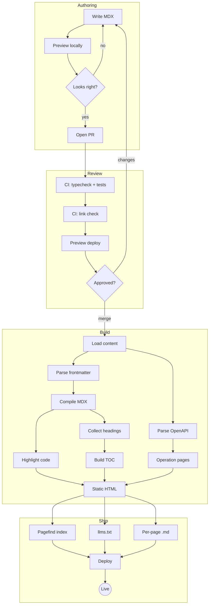
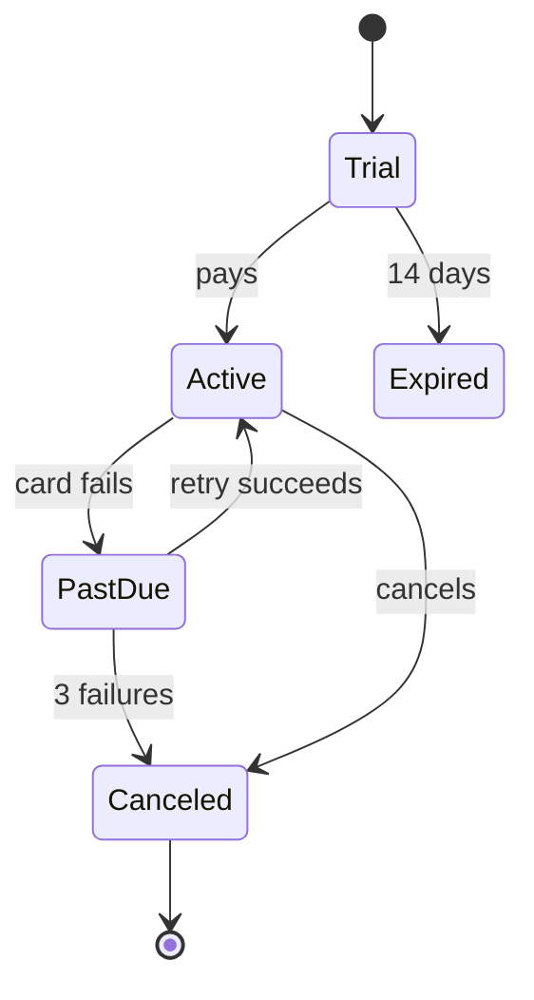
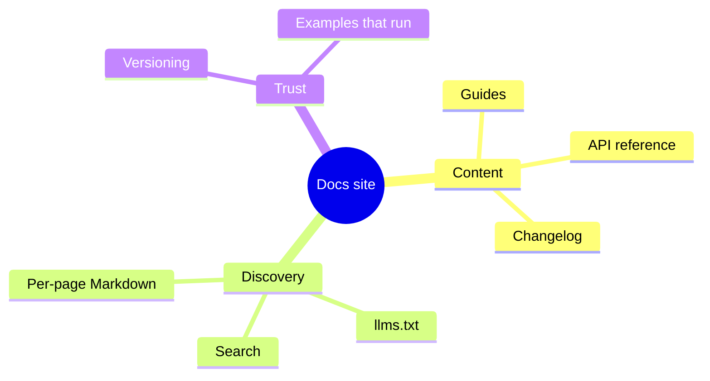
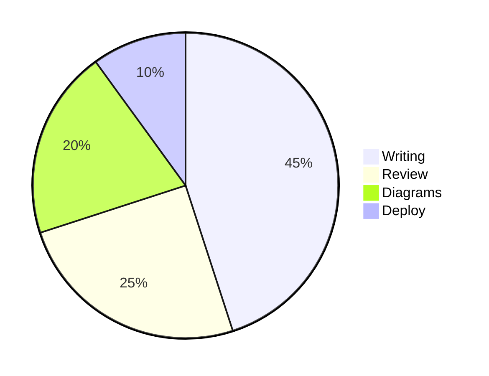

# Diagrams

Write a fenced code block with the language set to `mermaid` and it renders as a diagram:

````md

````


Hover a diagram (or tab to it) for the toolbar: zoom, copy the source, download an SVG, or open it fullscreen. In fullscreen there's a minimap for finding your way around large graphs.

## Setup

Diagrams are opt-in, because `mermaid` is a large install and plenty of docs sites never draw one. The scaffolded templates already have it on. For an existing site:

```bash
npm i mermaid
```

```ts
// mdx-components.tsx
import { mdxComponents } from '@inkform/framework/components';
import { Mermaid } from '@inkform/framework/mermaid';

export const siteMdxComponents = mdxComponents({ Mermaid });
```

Without that registration, `mermaid` fences still build — they render as a plain block of source, so nothing breaks while you decide.

Readers only download mermaid on pages that have a diagram, and only when one is about to scroll into view. Pages without diagrams ship none of it.

## Captions

Put `title="…"` (or `caption="…"`) after the language. It shows under the diagram, names the fullscreen view and the downloaded file, and is what screen readers announce.

````md
```mermaid title="Request lifecycle"
sequenceDiagram
  ...
```
````



The JSX form works too, if you're building the source in an expression:

```mdx
<Mermaid caption="Build pipeline" chart={`flowchart LR
  A --> B`} />
```

## Moving around

| Where | Zoom | Pan |
| --- | --- | --- |
| In the page | <kbd>Ctrl</kbd>/<kbd>⌘</kbd> + scroll, trackpad pinch, double-click, or `+` / `-` | Drag once zoomed in, or arrow keys |
| Fullscreen | Scroll, pinch, double-click | Drag, arrow keys, or click the minimap |
| Touch | Pinch | One finger once zoomed in |

A plain scroll over an inline diagram scrolls the page, not the diagram, so long posts don't trap the reader. `0` resets to fit.

## Theming

Diagrams take their colors from the site's `--fw-*` tokens, so they match whichever theme you run, and they redraw when the reader switches between light and dark. Styles written in the diagram itself (`style A fill:#111,color:#fff`) still win.

## Big graphs

Large diagrams are where the viewer earns its keep. Open this one fullscreen and use the minimap:



## Other diagram types

Anything Mermaid supports renders — state machines, ER diagrams, Gantt charts, mindmaps, and more.







## Writing diagrams with AI

Mermaid is plain text, and it's the diagram format language models write most reliably — ask for "a Mermaid flowchart of …" and paste the result into a fence. The source stays in your MDX, so it diffs, reviews, and renders on GitHub too. The per-page Markdown (any URL + `.md`) and `llms.txt` output keep the fence as-is, so agents reading your docs see the diagram source rather than an image.

If the source has a syntax error, the page shows mermaid's error message next to the source instead of an empty box.
